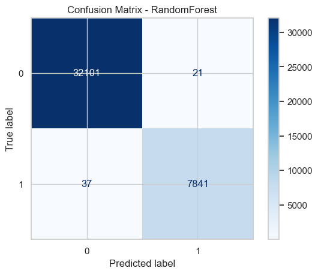

# 🧾 Learning from Deception: Machine Learning Approaches to Honeypot Intrusion Detection


[](https://doi.org/10.5281/zenodo.17393150)


This repository contains the implementation and analysis for my research project **"Learning from Deception"**, focusing on machine learning models for detecting and classifying honeypot intrusions.

The research has been **published on [Zenodo](https://zenodo.org/records/17393150)** (DOI: 10.5281/zenodo.17393150).

---

## 🧠 Overview

Honeypots are intentionally vulnerable systems used to attract and analyze cyberattacks.  
This project explores the use of supervised learning algorithms to classify malicious network traffic patterns captured from honeypots and predict intrusion types.

**Goal:**  
> To improve early intrusion detection by identifying deceptive attack vectors through data-driven insights.

---

## ⚙️ Setup Instructions

**Clone the repo:**
```bash
git clone https://github.com/harddikk/Learning-From-Deception.git
cd Learning-From-Deception
```

**Install dependencies:**
```bash
pip install -r requirements.txt
```

---

## 📊 Dataset

The dataset used is the MachineLearningCVE dataset.  
Due to licensing and file size, it’s not included in this repository.

To reproduce results, download the dataset from the official source and place all CSV files inside a folder named 
```bash 
MachineLearningCVE/
```
 at the project root.

---

## 🗂 Project Structure

<details>
<summary>Click to expand</summary>

```
Learning-From-Deception/
├── honeypot_intrusion_detection.ipynb      # Main Jupyter Notebook
├── requirements.txt                        # Python dependencies
├── LICENSE                                 # CC BY 4.0 License
├── README.md                               # This file
├── MachineLearningCVE/                     # Dataset folder (not included)
└── results/                                # Folder for selected plots/images
    ├── confusion_matrix_rf.png
    └── feature_importance_rf.png
```

</details>

---

## 🚀 Running the Notebook

Open
```bash
honeypot_intrusion_detection.ipynb
```
in Jupyter Notebook or VS Code, and execute all cells sequentially.  
Results (plots, accuracy metrics, confusion matrices, etc.) will be displayed inline.

---

## 🧩 Techniques Used

- Data preprocessing and cleaning
- Exploratory data analysis (EDA)
- Feature selection and correlation mapping
- Supervised ML algorithms:
  - Random Forest
  - Logistic Regression
  - Decision Tree
  - Naïve Bayes
- Evaluation metrics (Accuracy, Precision, Recall, F1-score)

---

## 📈 Results

<details>
<summary>Click to expand: Model Performance Metrics & Plots</summary>

                                                          
| Model               | Accuracy | Precision (weighted) | Recall (weighted) | F1-Score (weighted) |
|--------------------|----------|--------------------|-----------------|-------------------|
| Logistic Regression | 0.9416   | 0.9489             | 0.9416          | 0.9435            |
| Random Forest       | 0.9986   | 0.9985             | 0.9986          | 0.9985            |
| XGBoost             | 0.9991   | 0.9991             | 0.9991          | 0.9991            |

> Note: Metrics are calculated on the test split of the dataset.  

**Selected plots:**

  


> Confusion matrices for other models and feature importance for XGBoost are available in the notebook.

</details>

---

## 📚 Citation

If you use or reference this work, please cite:

```
Tiwari, Hardik. (2025). Learning from Deception: Machine Learning Approaches to Honeypot Intrusion Detection. Zenodo. https://doi.org/10.5281/zenodo.17393150
```

---

## 📄 License

This project is licensed under the **Creative Commons Attribution 4.0 International License**.  
You’re free to use, modify, and share it — just give proper credit.

---

## 👨‍💻 Author

Hardik Tiwari  
High school Researcher passionate about AI, cybersecurity, and system-level innovation.  
[Connect on LinkedIn](https://www.linkedin.com/in/harrdik-tiwari) 🚀
